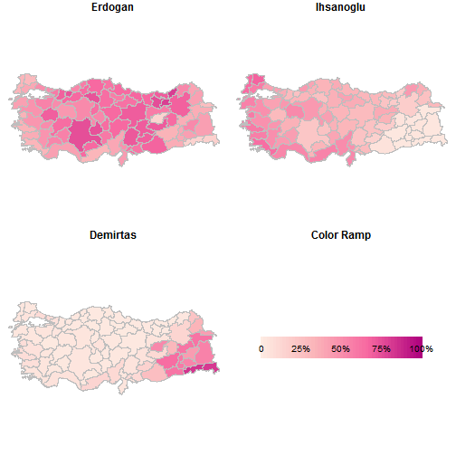

Turkish Presidential Elections, 2014
===
author: tonesofblue
date: 2014-08-22
transition: rotate

Couse Project<br/>
Developing Data Products<br/>
Coursera Data Science Specialization

Motivation
===

- Develop a graphical tool to explore presidential election accross Turkey.
- Experiment color schemes to obtain better presentation of variation in votes.

R Libraries Used
===

- The rgdal library is used for mapping.
- The RColorBrewer library is used to have beautiful color schemes for mapping.


```r
library(rgdal)
library(RColorBrewer)
```

Vector Layer and Election Data
===


```
OGR data source with driver: ESRI Shapefile 
Source: "../layer", layer: "trpe2014"
with 81 features and 5 fields
Feature type: wkbPolygon with 2 dimensions
```

```
  Province Id     P1      P2      P3
0    ADANA  1 0.3888 0.50474 0.10651
1 ADIYAMAN  2 0.6935 0.15563 0.15087
2    AFYON  3 0.6425 0.34399 0.01356
3     AGRI  4 0.3616 0.02302 0.61539
4   AMASYA  5 0.5722 0.41621 0.01164
5   ANKARA  6 0.5150 0.45054 0.03446
```

Sample Plot
===
 

